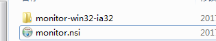
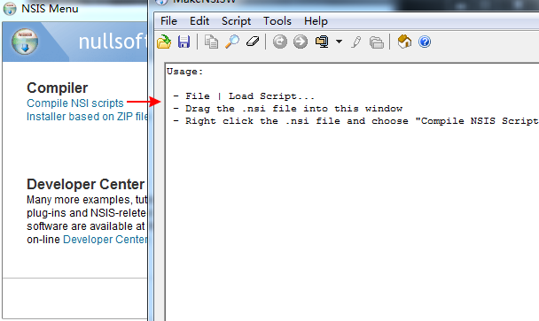
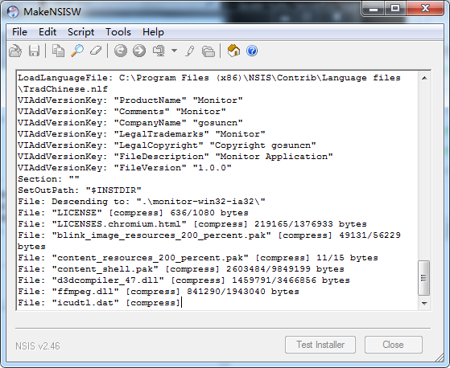

# monitor
 Monitor for spring boot

# 操作
To start:

```bash
$ npm install
```

To develop:

```bash
$ npm run build:watch
# in a new tab, run electron app
$ npm run dev
```

To build for production:

```bash
$ npm run build
```

To lint you code:

```bash
$ npm run lint
```
To package :
```bash
$ npm run package
```

## 目录结构
```txt
+---build                          
|     config.js
|     utils.js
|     webpack.base.js
|     webpack.dev.js
|     webpack.prod.js
|
+---src                            
|   +---assets
|   |   +---css
|   |   +---fonts
|   |   +---js
|   +---components
|   +---filter
|   +---router
|   |      index.js
|   +---scripts
|   |      dbService.js
|   |      operation.js
|   |      Tray.js
|   +---store
|   |      boot.js
|   |      db.js
|   |      spawns.js
|   |
|   +---views
|   |      Detail.vue
|   |      Home.vue
|   |      SysInfo.vue
|   |      Welcome.vue
|   |   app.js
|   |   App.vue
|
|   index.html
|   main.js
|   package.json
```

## TODO List
 提取 CSS 文件
 提取 JS 文件
 

## 技术栈 
**构建**
* [x]  **[webpack](http://webpack.github.io/)**
* [x]  **[babel](http://babeljs.io/)**
* [x]  **[es6](http://babeljs.io/learn-es2015/)**
* [x]  **[es6 中文文档](http://es6.ruanyifeng.com/#docs/)**

**Electron**
* [x]  **[electron](http://electron.atom.io/)**
* [x]  **[Electron 中文文档](http://www.kancloud.cn/wizardforcel/electron-doc/137814)**

**Vue**
* [x]  **[Vue.js](http://cn.vuejs.org/v2/guide/)**
* [x]  **[vue-router](http://router.vuejs.org/zh-cn/)**
* [x]  **[vue-loader](http://vue-loader.vuejs.org/en/)**
* [x]  **[vue-resource](https://github.com/pagekit/vue-resource/tree/master/docs)**

**Vue libs**
* [x]  **[museui](https://museui.github.io)**
* [x]  **[element](http://element.eleme.io/)**
* [x]  **[photon](http://photonkit.com/components/)**

**Browser DB**
* [x]  **[lovefield](https://github.com/google/lovefield)**

**Nodejs**
* [x]  **[nodejs 中文文档](http://www.nodeclass.com/api)**

**Spring boot**
* [x]  **[spring-boot docs](http://docs.spring.io/spring-boot/docs/1.1.x/reference/htmlsingle/#production-ready-endpoints)**

## 打包成可安装文件
### Mac
* [upx 压缩.exe文件](https://upx.github.io/)

> `E:\upx308w>upx monitor.exe`

> `E:\upx308w>upx -d monitor.exe`  解压

### window
[nsis](http://nsis.sourceforge.net/)

操作流程:



